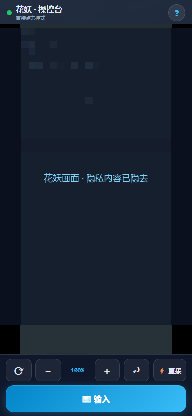

# 花妖远程操控台

这是"花妖"辅助工具的**远程操控台**：用浏览器实时看到电脑上花妖的画面，轻点一下屏幕，就能真的在电脑上点一下对应的位置。走到哪儿，花园就在手边。

---

## 这个项目是什么？

一句话：**把电脑上花妖的画面搬到浏览器里，还能隔着浏览器直接操作它。**

它特别适合这样的场景——

- 人不在电脑前，想看看花妖现在在干什么、花园成什么样了；
- 想用手机就能操控花妖，不用守在电脑旁边；
- 有些窗口小按钮不好点，想放大画面、精确瞄准后再下手。

> 打个比方：花妖是帮你照看花园的"管家"，这个操控台就是发给你的**遥控器**——人在哪，都能看到管家在忙什么，还能顺手"点"它一下。

### 移动端效果

下面是手机浏览器里打开操控台的样子（中间画面是电脑上花妖的实时内容，**示例图已做隐私处理**）：

- **顶栏**：项目标题、当前模式提示、帮助按钮；
- **中间画布**：电脑上花妖的实时画面（支持单指点击、双指缩放、拖动平移）；
- **底部工具栏**：刷新、缩放控制、模式切换、文本输入。

### 花妖是谁？

花妖是一个在电脑上运行的**辅助挂机工具**，帮《我的花园世界》的玩家自动浇水、自动收花、定时挂机，让玩家少操心。本操控台就是为它配套的"远程遥控器"，它俩是搭档。

---

## 这个项目能做什么？

| 功能 | 说明 |
| --- | --- |
| 实时看画面 | 浏览器里显示电脑上花妖的**实时截图**，电脑上是什么样，手机上看就是什么样 |
| 点击操控 | 单指轻点画面 = 在电脑上点击对应位置；所见即所得 |
| 精确点击 | "手动点击"模式下，拖动绿色光标慢慢瞄准，确认后再点击，不怕点错 |
| 文本输入 | 先在画面上点一下输入框，再按「⌨ 输入」发送文字，支持中文、支持换行 |
| 放大 / 平移 | 双指捏合缩放，放大后拖动看细节；电脑上还能用鼠标滚轮缩放、按住拖动 |

操作方式（移动端 + 桌面端）：

| 想做什么 | 手机操作 | 电脑操作 |
| --- | --- | --- |
| 点击 | 单指轻点 | 单击 |
| 放大 / 缩小 | 双指捏合 | 鼠标滚轮 |
| 看细节 | 放大后单指拖动 | 按住鼠标拖动 |
| 精确点击 | "手动点击"模式 + 绿色光标 + 大「点击」按钮 | 鼠标悬停光标跟随，点「点击」确认 |
| 输入文字 | 点画面中的输入框 →「⌨ 输入」→ 输入内容回车发送 | 同上 |
| 刷新画面 | 「⟳ 刷新」 | 同上 |

---

## 安装与启动

### 需要准备什么

| 需要的东西 | 它是什么 | 必须要吗 |
| --- | --- | --- |
| 花妖 | 被操控的辅助挂机工具（独立安装） | 必须 |
| Node.js | 负责"传话"的小工具 | 必须 |
| AutoHotkey v2 | 负责"动手操作"（截图、点击）的小软件 | 必须 |

> 别被名字吓到。Node.js 和 AutoHotkey 都是免费、正规、社区里常用的软件，安装时一路点"下一步"就好。

### 四步启动

**第 1 步：装好基础零件**
- 安装 **Node.js**：打开 `nodejs.org`，选左侧 **LTS** 版本下载安装；
- 安装 **AutoHotkey v2**：打开 `autohotkey.com`，选 v2 版本下载安装。

装好后先打开花妖，让它出现在电脑屏幕上。

**第 2 步：放好项目文件夹**
把本项目文件夹整个放到你喜欢的位置（比如桌面或 D 盘）。**文件夹里的文件一个都别删、别乱挪**，它们是一个整体，缺一不可。

**第 3 步：启动服务**
1. 打开本项目文件夹；
2. 在文件夹顶部的"地址栏"（显示路径的白框）里输入 `cmd` 并回车，弹出黑色命令行窗口；
3. 输入 `npm start` 回车，看到"花妖操控台已启动"就成功了。

> 注意：这个黑色窗口**别关**，它是"总开关"，一关服务就停了。

**第 4 步：打开操控画面**
- **本机使用**：浏览器打开 `http://localhost:13000`
- **手机使用**：手机和电脑连**同一个 WiFi**，手机浏览器输入 `http://电脑IP:13000`（IP 怎么查见"常见问题"）

---

## 常见问题（FAQ）

**Q：打开页面提示"找不到花妖窗口"？**
A：先确认花妖已经打开。如果它缩到了右下角系统托盘（一个小图标），点一下托盘里的花妖图标恢复显示，再刷新页面。

**Q：提示"未检测到 AutoHotkey"？**
A：说明 AutoHotkey 没装好。去 `autohotkey.com` 下载 v2 版本安装，装完重启服务（重新执行第 3 步）。

**Q：手机打不开操控画面？**
A：按顺序检查：
1. 手机和电脑连的是**同一个 WiFi**；
2. 打开项目文件夹里的 `.env`，确认写着 `HOST=0.0.0.0`（`127.0.0.1` 表示仅本机访问，改成 `0.0.0.0` 后重启服务）；
3. 在黑色窗口里输入 `ipconfig` 回车，找到"IPv4 地址"（形如 `192.168.x.x`）；
4. 手机浏览器输入 `http://192.168.x.x:13000`；
5. 仍不行，多半是电脑防火墙拦住了，可在防火墙放行 13000 端口后再试。

**Q：画面黑屏或内容很旧？**
A：点「⟳ 刷新」。操控台每完成一次操作都会自动重拍一张"照片"，刷新即可看到最新画面。

**Q：点击了却没反应？**
A：多半是花妖窗口被最小化或缩到托盘了。恢复显示再试，并先「⟳ 刷新」确认画面是花妖当前真实样子。

**Q：启动时提示"端口被占用"？**
A：打开 `.env`，把 `PORT=13000` 改成别的数字（如 `13001`），保存后重启服务，浏览器地址里的数字也要跟着改。

---

## 使用注意

- 远程操控只适合在自己家里、自己信任的 WiFi 下使用。**不要把操控地址分享给陌生人**，也别让电脑长期暴露在公共网络下，防止被别人遥控。
- 操控台只负责"看"和"点"，不涉及你的账号密码，也**不要在任何输入框里输入账号密码**。
- 适度使用辅助工具，关注游戏官方规定，理性游戏。
- 如果不想用了，把 `.env` 里的 `HOST` 改回 `127.0.0.1`（仅本机访问），或关掉黑色窗口，随时可以停用。

---

## 写在最后

本项目源自"花妖"辅助挂机工具的一个朴素想法：**人不用守在电脑前，也能随时照料自己的花园。**

祝使用愉快。
